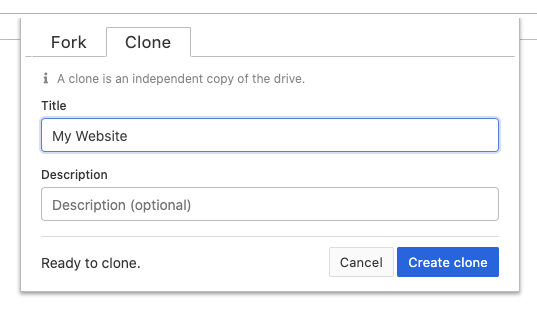

# Cloning Hyperdrives

"Cloning a hyperdrive" means creating an identical copy.

You can clone a hyperdrive you visit to make an independent copy which you can edit and share.

To clone a hyperdrive, click the blue address button on the left of the URL bar. Then click "Clone Drive."

You will be prompted to choose a new title and description. You can leave these as-is, but it's recommended to change them to help identify your unique copy.

When you're ready, click "Create clone" to create the drive. You will navigate to the newly-created clone.

