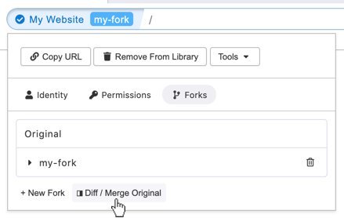
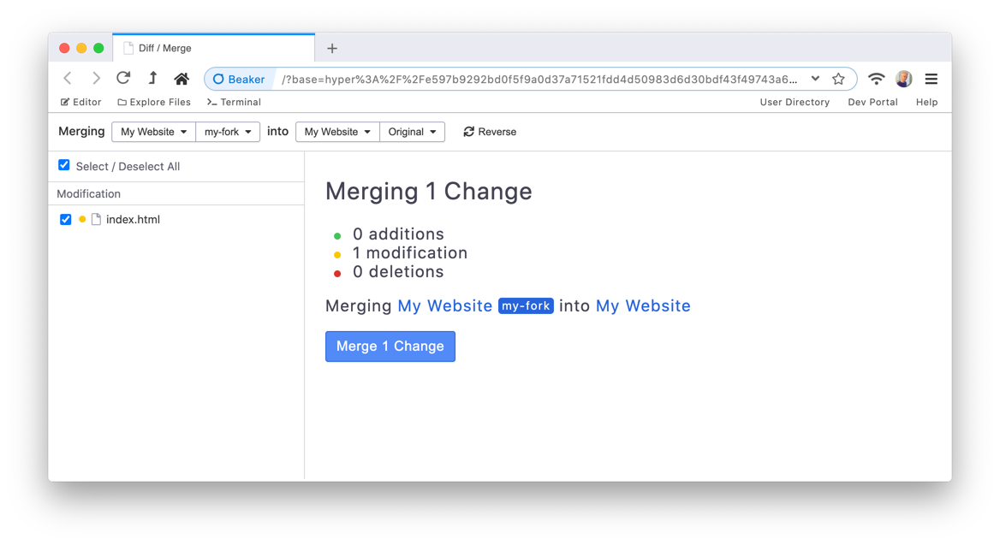
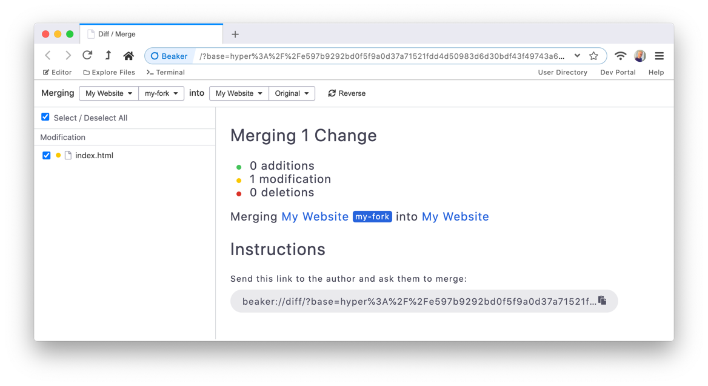

# Comparing and Merging Hyperdrives

Sometimes it's useful to copy files between hyperdrives. This may be particularly useful after [forking a hyperdrive](forking-hyperdrives.md) and making some changes.

To open the "Compare and Merge" interface, navigate to your hyperdrive, click the blue site-info button on the left of the URL, go to the "Forks" submenu and click "Diff / Merge Original".

This will open the compare interface.

Choose the source drive on the top left and the target drive on the right using the dropdowns.

## Merging Drives

Select the files you want to merge by clicking the checkboxes in the left nav, and then click "Merge {n} Changes" to copy the files into the target.

You can review the differences by selecting individual files in the left nav.

The "Merge" will copy the files into the target drive, overwriting the selected files only.

## Other Users' Drives

If you don't own the target drive, you'll see a screen like this:

Send the URL to the drive owner. It will provide them with the same interface where they can review the changes and merge.

