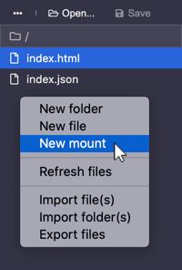
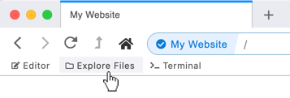
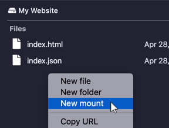

# Creating Mounts

"Mounting" is a tool which links one hyperdrive to another as a subfolder.

Mounts are useful for a variety of use-cases. They can be used to make collections, to attach code-module dependencies, and more.

A mounted drive will behave just like a subfolder. If you don't "own" the mounted drive, it will be read-only, even if the containing drive is yours.

## In the Editor

Visit your hyperdrive and [open the editor](../beginner/editor.md). Then expand the files listing by clicking the folder icon.

Right-click in the files listing \(but not on a file\) and select "New Mount."

You will be prompted to select a hyperdrive to mount. If your target drive is not in the listing, enter the drive's URL in the input.

You'll then be prompted to enter the mount's name. This is the name of the "folder" which the mount will represent. Choose a name and press "OK."

Your new mount will appear in the editor's files listing.

## In the Files Explorer

Visit your hyperdrive and open the files explorer by clicking "Explore Files."

Right-click in the files listing \(but not on a file\) and select "New Mount."

You will be prompted to select a hyperdrive to mount. If your target drive is not in the listing, enter the drive's URL in the input.

You'll then be prompted to enter the mount's name. This is the name of the "folder" which the mount will represent. Choose a name and press "OK."

Your new mount will appear in the explorer's files listing.

## In the Terminal

Visit your hyperdrive and open the terminal by clicking "Terminal."

You can create a directory by typing `mount` followed by the drive URL then the mount's name.

