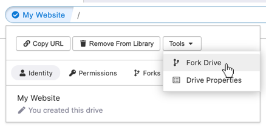
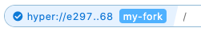
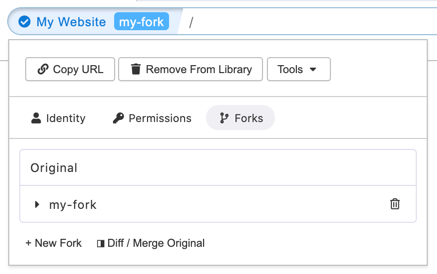

# Forking Hyperdrives

"Forking a hyperdrive" means creating a copy which is attached to its parent.

Forking is useful during development flows. It creates a clone which tracks its origin. You can then easily [compare and merge](comparing-and-merging-hyperdrives.md) with the original drive.

You may want to fork a drive when you want

1. To work on a drive without publishing the changes immediately, or
2. To work on a drive with other people.

## Creating forks

To fork a hyperdrive, click on the Site Info button on the left side of the address bar. Then click "Tools" and then "Fork Drive."

You will be prompted to choose a label for the fork. The label is used privately to help you differentiate from the original and other forks. Choose a label and then click "Create fork" to finish.


You can make an independent copy of a drive (not attached to its parent) by going to the "Copy" tab.


## Managing forks

When visiting a fork, you will see the fork label in the Site Info button of the address bar.

To view all forks of a site, click on the Site Info button and click on the "Forks" submenu.

From the Site Info panel you can see a list of available forks. You can navigate between them and the original, delete them, and create new forks.

You can view the forks of a hyperdrive in "My Drives" by clicking on the fork number in the listing.

