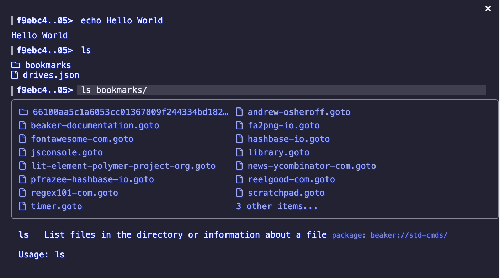

# Webterm

Webterm is a web-based terminal environment that ships with Beaker. It is superficially similar to the Unix "bash" terminal, but designed specifically for the browser and Hyperdrive environment.



## Basic usage

To open the terminal, press `Ctrl+~` or click on the "Terminal" button on the toolbar of the browser.

The terminal uses a command syntax that's similar to "bash" in Unix.

```text
command [-s|--switch {param}] {param1} {param2}
```

At this stage, there is no piping or sub-invocations. All commands translate to JavaScript functions which can respond with HTML interfaces.

## Builtin commands

You can type `help` at any time to see a full list of available commands. Here are some of the useful builtins:

* **open** - Navigate the terminal and the attached page to the given path or URL.
* **cd**. Navigate the terminal to the given path or URL.
* Filesystem
  * **ls**. List the files in a given location.
  * **pwd**. Get the current terminal location.
  * **mv**. Move a file or folder.
  * **cp**. Copy a file or folder.
  * **mkdir**. Create a folder.
  * **mount**. Create a mount-link.
  * **rm**. Delete a file, folder, or mount.
  * **meta**. View or edit the metadata of a file.
  * **cat**. View the contents of a file.
  * **edit**. Edit a file.
* Page Interactions
  * **page exec**. Execute JavaScript on the current page.
  * **page inject**. Inject CSS into the current page.
* Command Management
  * **commands ls**. List installed command packages.
  * **commands install**. Install a new command package.
  * **commands create**. Create a new command package.

## Environment variables

Webterm supports environment variables in its command invocations. These are words prefixed by a '$' dollar sign.

```text
echo $pwd
```

To view and modify the environment variables, use the `env` command. By default, Webterm defines the following environment vars:

* `$@` The URL of the current page which Webterm is attached to.
* `$pwd` The URL of the current location which Webterm is working in.

## Creating and installing new commands

You can manage your installed Webterm commands by using the `commands` command. Commands are bundled into "command package" hyperdrives.

To create a new command, run `commands create`. It will guide you through creation of your "command package" and provide a new drive with basic examples.


Webterm Commands run with full access to the browser's internal APIs and are therefore able to change anything. **Only install commands which you trust!**


Command invocations are automatically parsed and passed to the functions that your package's `index.js` file exports. You will need to include an `index.json` that provides help and some parsing guidelines for the options. An example `index.json`:

```javascript
{
  "type": "webterm.sh/cmd-pkg",
  "title": "My Commands",
  "commands": [
    {
      "name": "hello",
      "help": "Says hello",
      "usage": "hello [-u] [{who}]",
      "options": [
        {
          "name": "uppercase",
          "abbr": "u",
          "help": "Output in all-uppercase",
          "boolean": true,
          "default": false
        }
      ]
    }
  }
}
```

And its matching `index.js`:

```javascript
export async function hello (opts = {}, who = 'world') {
  var str = `hello ${who}`
  if (opts.uppercase) str = str.toUpperCase()
  return str
}
```

The "commands" section is an array of objects with the following attributes:

* **name**. The name of the command.
* **help**. An optional explanation of the command.
* **usage**. An optional summary of the command's parameters.
* **options**. An optional array of the switch-options which can be provided. Each object can have the following attributes:
  * **name**. The long name of the option.
  * **abbr**. An optional short name for the option.
  * **help**. An explanation of the option.
  * **boolean**. If true, the option does not accept a value.
  * **default**. The default value of the option if not specified by the invocation.
* **subcommands**. An optional array of objects describing subcommands of this command. Use this when the command is actually a prefix to multiple commands.
  * The objects in this array use the same schema as the "commands" array.

Command are invoked with a `this` object that is populated with some custom APIs:

* env
  * `getAll()`. Returns an object containing all current env variables.
  * `get(key)`. Returns the value of the given env variable.
  * `set(key, value)`. Sets the given env variable's value.
  * `goto(location)`. Sets the CWD.
  * `focus()`. Focuses the terminal prompt.
  * `resolve(location)`. Resolves the given location against the CWD.
* page
  * `goto (location, {newTab})`. Navigates the attached page to the given location. If `newTab` is true, creates a new tab.
  * `refresh()`. Refreshes the current page.
  * `exec(js)`. Executes the given javascript in the current page.
  * `inject(css).` Injects the given styles in the current page. Returns an ID which can be used in uninject.
  * `uninject(id)`. Uninjects styles which had previously been injected.
* `out(...args)`. Outputs the arguments to the Webterm console. Can be provided HTML elements.
* `prompt(txt, defaultValue)`. Runs an input prompt.

Some example usages:

```javascript
this.out('Hello world!')
this.page.exec('alert("pwned!")')
this.env.goto('https://beakerbrowser.com')
```

## Page commands

Pages can export their own commands, which they define using the [beaker.terminal API](../apis/beaker.terminal.md). Page commands are prefixed with an '@' symbol.

```text
@open-issue 1
@login --user pfrazee --password hunter2
@help
@go_inbox
```

Unlike normal Webterm commands, page commands run on the page and therefore have no special privileges. They also do not have access to the `env`, `page`, `out`, and other APIs attached to the `this` object.
