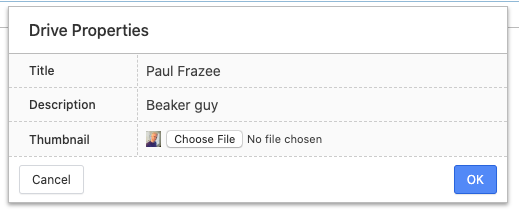

# Changing a Drive Title or Thumbnail

Every hyperdrive has a title, description, and thumbnail.

To change them, open the "drive properties" dialog and make your changes.

You can reach this dialog multiple ways.

## Editing Properties From The Drive

Visit the drive, then click the blue address button in the URL bar. In the menu that opens, select "Drive Properties."

## Editing Properties From "My Drives"

Open a new tab, then navigate to the "My Drives" section. Right click on your target and select "Drive Properties."

