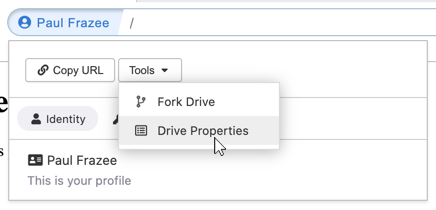

# Changing a Drive's Title or Thumbnail

Every hyperdrive has a title, description, and thumbnail.

To change them, open the "Drive Properties" dialog and make your changes.

You can reach this dialog in multiple ways.

## From the Site Info button

Visit the drive, then click on the Site Info button (the blue button on the left side of the address bar). Then click "Tools" and select "Drive Properties."

## From "My Drives"

Open a new tab and look in the "My Drives" section. Right-click on your target drive and select "Drive Properties."

