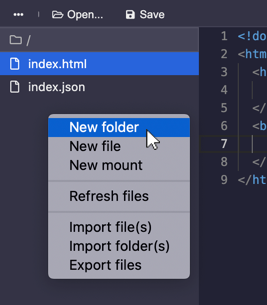

# Creating Files and Folders

## In the Editor

Visit your hyperdrive and [open the editor](editor.md). Then expand the files listing by clicking the folder icon.

Right click in the files listing \(but not on a file\) and select "New File" or "New Folder."

You will be prompted for the file or folder name. After choosing a name, the file/folder will appear in the listing.

## In the Files Explorer

Visit your hyperdrive and open the files explorer by clicking "Explore Files."

Right click in the files listing \(but not on a file\) and select "New File" or "New Folder."

You will be prompted for the file or folder name. After choosing a name, the file/folder will appear in the listing.

## In the Terminal

Visit your hyperdrive and open the terminal by clicking "Terminal."

You can create a directory by typing `mkdir` followed by the foldername.

You can create a file by typing `edit` followed by the filename.

Using `edit` will open the editor where you can then write the content of the file.

