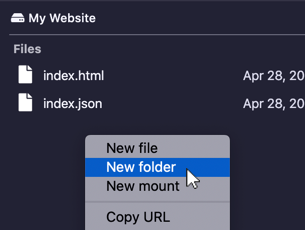
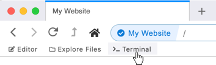

# Creating Files and Folders

## In the editor

Visit your hyperdrive and [open the editor](using-the-editor.md). Then expand the files listing by clicking on the ellipsis icon.

Right-click in the files listing \(but not on a file\) and select "New file" or "New folder."

You will be prompted for the file or folder name. After choosing a name, the file/folder will appear in the listing.

## In the files explorer

Visit your hyperdrive and open the files explorer by clicking "Explore Files."

Right-click in the files listing \(but not on a file\) and select "New file" or "New folder."

You will be prompted for the file or folder name. After choosing a name, the file/folder will appear in the listing.

## In the terminal

Visit your hyperdrive and open the terminal by clicking "Terminal."

You can create a directory by typing `mkdir` followed by the folder name.

You can create a file by typing `edit` followed by the filename.

Using `edit` will open the editor where you can then write the content of the file.

