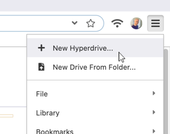
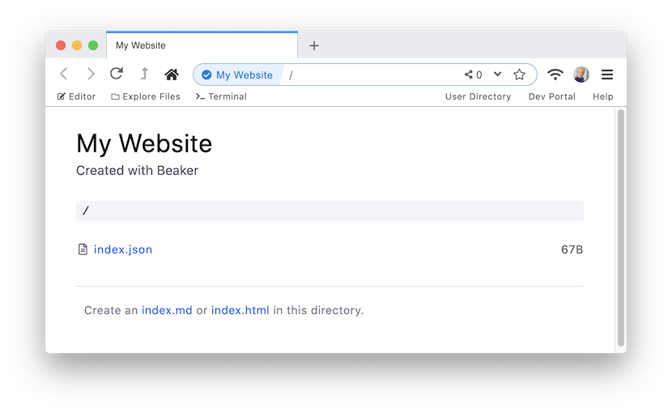

# Creating New Hyperdrives

You can create as many hyperdrives as you want. Each hyperdrive has its own URL. You [share the URL](sharing-hyperdrives.md) so that other people can visit the hyperdrive.

Only the creator of a hyperdrive can change its files. Visitors can only view the drive \(though they can [fork the hyperdrive](../advanced/forking-hyperdrives.md) to make their own copy\).

To create a new hyperdrive, click on the hamburger menu on the top right of the browser.

Then select "New Hyperdrive..."

You will be prompted to input a title and, optionally, a description. These will be used to identify the hyperdrive.

You will be taken to the new hyperdrive which is \(mostly\) empty.

Your hyperdrive is now ready to edit. You can create a new `index.md` \(for Markdown\) or `index.html` \(for HTML\) by clicking on the prompts below.

Next, [use the editor](using-the-editor.md) to develop the hyperdrive.

