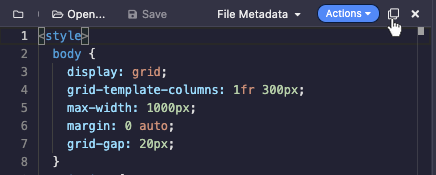
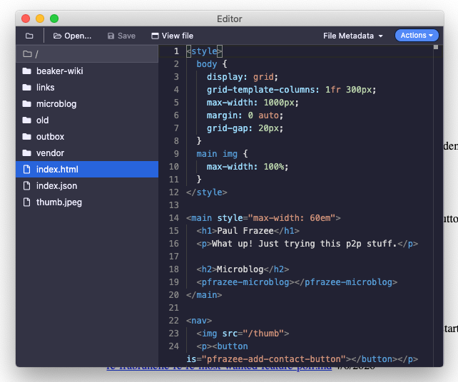

# Detaching the Editor

By default, the editor operates in "attached mode." This means that the active buffer will change to match the currently-viewed page. If you click on a link and land on a new page, your editor will show the source of that page.

If you want to detach the editor from the current page, you can click on the "detach" button on the top right of the editor.

This will pop the editor out into a separate window. In this "detached mode," the editor will stay on the last selected buffer independently of the current page in the browser.

