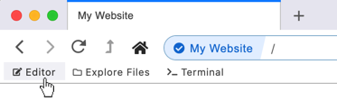
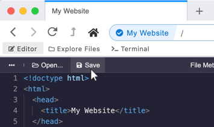

# Using the Editor

The builtin editor is a quick way to view and edit the source code of a hyperdrive.

To open the editor:

* Click the `Editor` button on the toolbar of the browser,
* Right-click the page and select `Sidebar > Editor`, or
* Press `Cmd+B` \(macOS\) or `Ctrl+B` \(Windows / Linux\).

## Saving Files

To save your work, press the "Save" button or press `Cmd+S` \(macOS\) or `Ctrl+S` \(Windows / Linux\) while the editor is focused. The page will automatically refresh with your updates.

## Navigating Files in the Hyperdrive

To view a files listing for the current hyperdrive, click the ellipsis icon in the top left.

