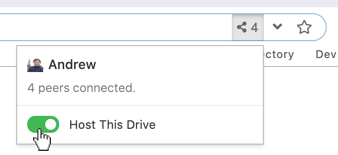
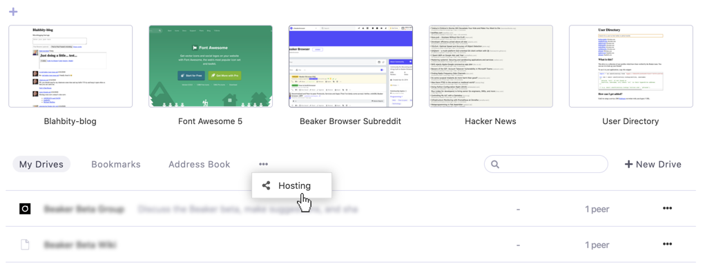
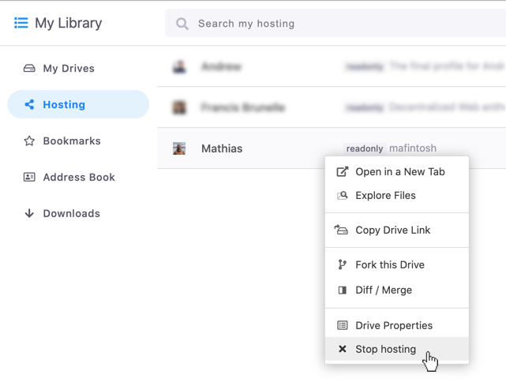

# Hosting Hyperdrives

You can help keep other people's hyperdrives online by contributing bandwidth. This is called "hosting."

To host a drive, visit the drive and click on the peer count on the right side of the URL bar. You will see a toggle. Switch it to the green "on" state.

You can turn off hosting by toggling the button again.

## Managing Hosted Hyperdrives

To see the drives you're currently hosting, open a new tab and click the ellipsis icon underneath your pinned bookmarks. In the menu, click the "Hosting" link.

You can stop hosting drives in that listing by right-clicking on them and selecting "Stop hosting."

