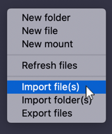
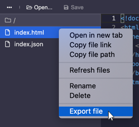
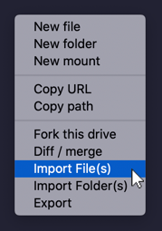
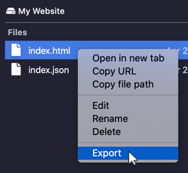

# Importing and Exporting Files

## In the editor

Visit your hyperdrive and [open the editor](using-the-editor.md). Then expand the files listing by clicking on the ellipsis icon.

Right-click in the files listing \(but not on a file\) and select "Import file\(s\)" or "Import folder\(s\)" to import files or folders, or "Export files" to export all files in the drive.

You can export individual files or folders by right-clicking on the file and selecting "Export."

## In the files explorer

Visit your hyperdrive and open the files explorer by clicking "Explore Files."

Right-click in the files listing \(but not on a file\) and select "Import file\(s\)" or "Import folder\(s\)" to import files or folders, or "Export files" to export all files in the drive.

You can export individual files or folders by right-clicking on the file and selecting "Export."

