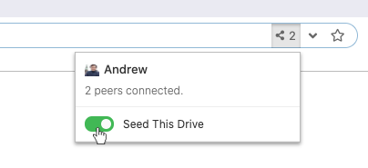
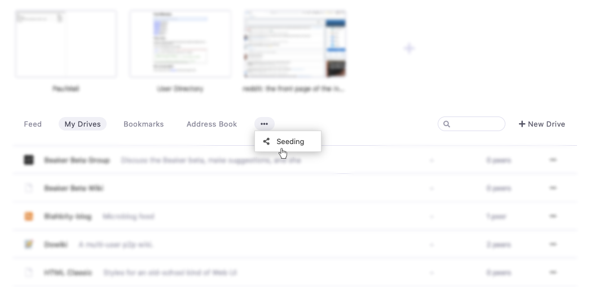
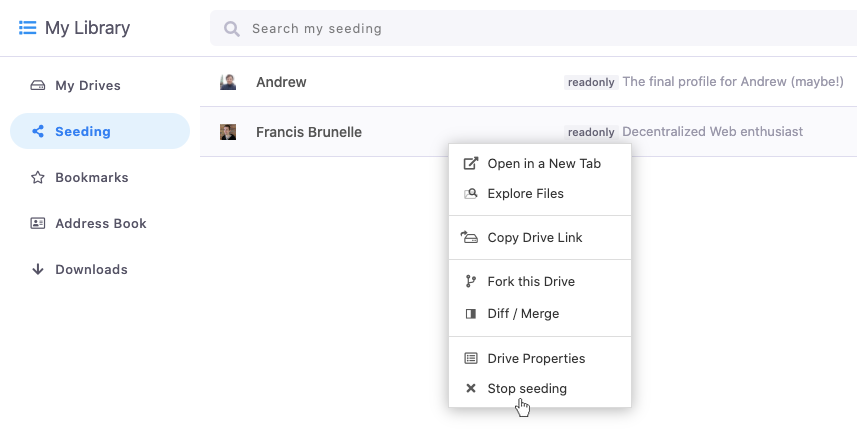

# Seeding Hyperdrives

You can help keep other people's hyperdrives online by contributing bandwidth. This is called "seeding."

To seed a drive, visit the drive click on the peer-count on the right side of the URL bar. You will see a toggle. Switch it to the green "on" state.

You can turn off seeding by toggling the button again.

## Managing Seeded Hyperdrives

To see the drives you're currently seeding, open a new tab and click the ellipsis icon underneath your pinned bookmarks. In the menu, click the "Seeding" link.

You can stop seeding drives in that listing by right clicking on them and selecting "stop seeding."

