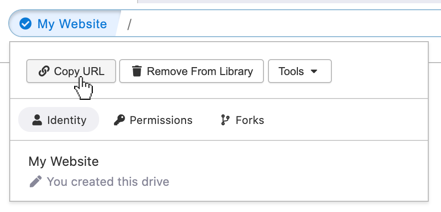

# Sharing Hyperdrives

Each hyperdrive has its own URL. You share the URL so that other people can visit it.

You can copy the URL by clicking the dropdown arrow on the right of the location bar and selecting "Copy URL."

The hyperdrive is shared from your computer. You can see how many people have connected to the drive by looking at the peer count in the location bar.

