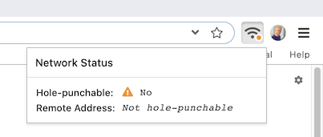

# Hole-punchability


**If your network is "not hole-punchable," you may have trouble connecting to other peers.** Read this article to learn more.


Beaker's peer-to-peer networking relies on "hole-punching," a technique which makes your device accessible to people outside of your local network.

In some cases, hole-punching may fail. This will be indicated by Beaker in the top right:

This doesn't mean that **all** connections will fail, but it does mean that the odds of failed-connection are higher.

### Why does this happen and what can I do?

Some network routers and VPNs do not support hole-punching. If you're using a VPN, try disabling it. You may also need to try other networks.

We're working on ways to ensure connectivity even if hole-punching fails. Sorry if this is an ongoing problem for you!

