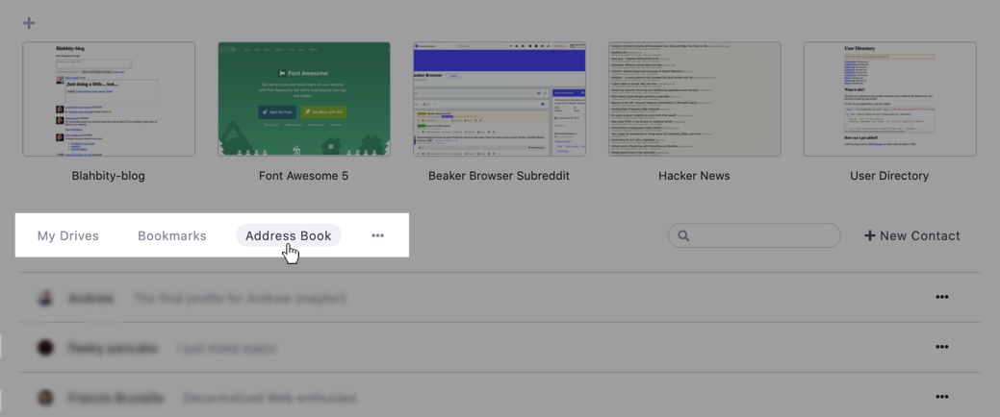

# Your Address Book

In Beaker, every user has a [profile drive](your-profile-drive.md) which represents them.

The "Address Book" is a way to keep track of your contacts' profile drives. Applications can request contacts from your address book, and you can use it to quickly find their profiles.

Your address book is private. Unless you give access to an application, nobody else can see it.

## On the Start Page

When you open a new tab, you can access your address book by clicking the "Address Book" link under your pinned bookmarks.

To add a contact, click the "+ New Contact" button.

Enter the URL of your new contact's [profile drive](your-profile-drive.md) then click "Save." \(You'll need to ask your friend for their URL or [find it in a directory](https://userlist.beakerbrowser.com/).\)

Applications can ask for individual contacts or to read your entire address book. See the [beaker.contacts](../apis/beaker.contacts.md) API.

