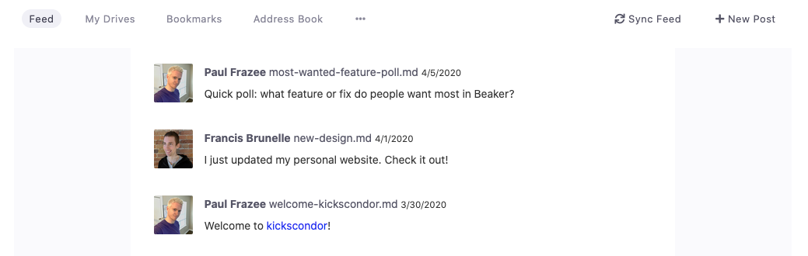
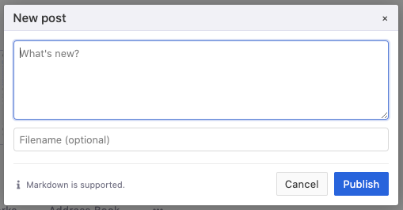

# Your Feed

Beaker's start page includes a "Feed" for sharing news, links, photos, and more. This UI fetches microblog posts from every hyperdrive in [your addressbook](your-address-book.md).

To create a new post, click "+ New Post."

The post you create will be written to [your Profile Drive](your-profile-drive.md) under the `/microblog` folder as a `.md` file. You can choose a filename for the post if you want, or let it generate one automatically.

