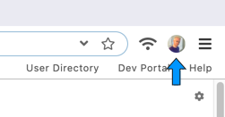

# Your Profile Drive

Every Beaker user has a hyperdrive that represents them publicly. This is the "Profile Drive." It is created during the initial setup.

You can find your profile drive by looking at the top right of the browser UI. You will find your profile picture. You can click on it to open your profile drive.

To change your name, bio, or picture, see [Changing a Drive Title or Thumb](../beginner/changing-a-drive-title-or-thumb.md).

Some applications will use your profile save and publish content. \(This is how [your feed]() works.\) When they want to use your profile, you will be prompted with this interface:

You can choose your profile to grant read access. Any additional permissions will be requested.

[Share your profile drive](../beginner/sharing-hyperdrives.md) with other users to connect with them. You can add other users' profiles to [your address book](your-address-book.md) to keep track of them.

See also: the [beaker.contacts](../apis/beaker.contacts.md) API.

