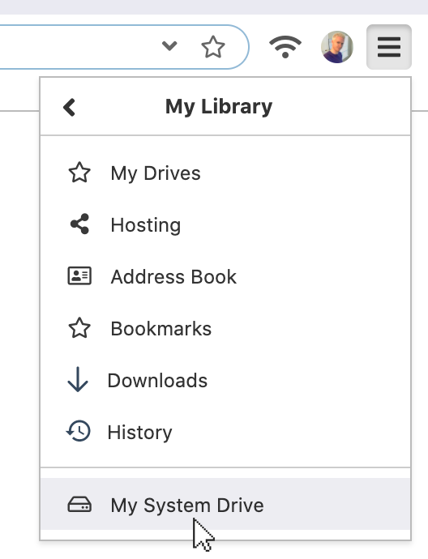

# Your System Drive

Beaker automatically creates a private "System Drive" for storing your private information. It contains your saved hyperdrives, addressbook, bookmarks, webterm commands, and more.

You can find the drive by opening the browser menu and selecting "My System Drive."

Beaker assigns your system drive the `hyper://system/` domain name. You cannot share content using the system drive, as each user has their own `hyper://system/` address. \(This is a good thing because your system drive contains private information!\)

