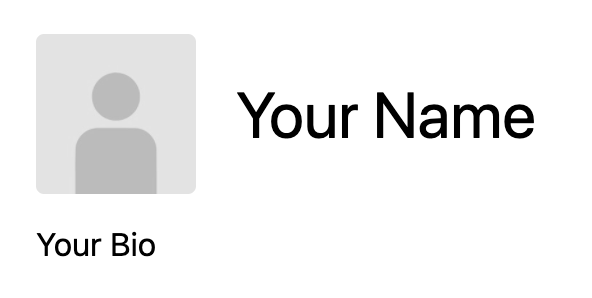
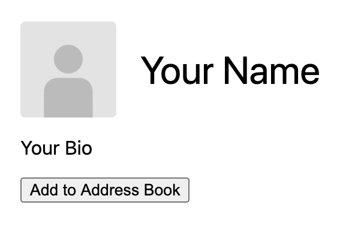
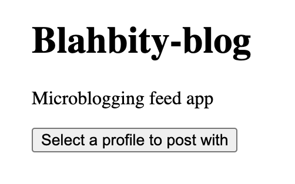
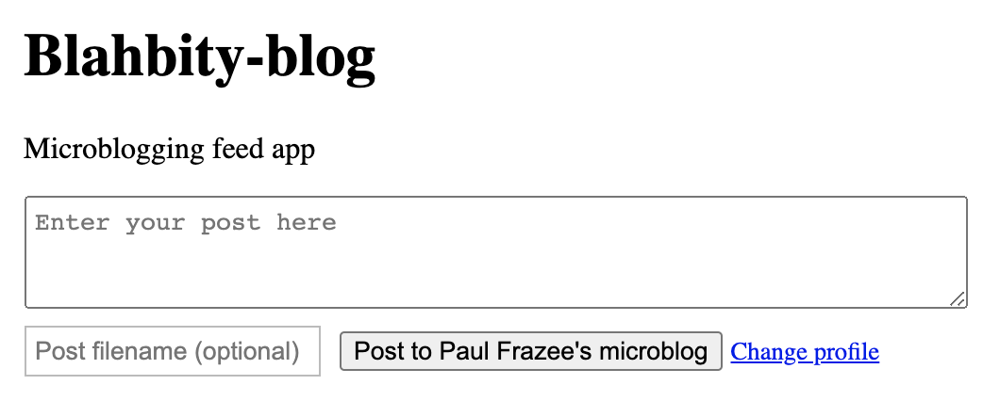

# Joining the Social Network

Beaker includes a social network of personal websites. We call these websites the ["Profile Drives."](intermediate/your-profile-drive.md) Your profile drive acts as your personal space and your identity on the network. It's also used by applications to publish your content.


Every user has a "Profile Hyperdrive" which represents them on the network. [Learn more](intermediate/your-profile-drive.md).


In this guide, we're going to personalize your profile drive, find some other users to add to your address book, get you listed in Beaker's User Directory, and say hello on your social media feed.

## Customizing your profile drive

During Beaker's setup, you filled out a name, picture, and bio for your profile. You can visit your profile drive by clicking your picture at the top right of the browser.


You will find your profile drive is very plain. That's because we want you to build it! \(Frankly it was a cost-cutting measure but don't tell anyone.\)



[Open the editor](beginner/using-the-editor.md) to see the source code:

```markup
<!doctype html>
<html>
  <head>
    <meta charset="utf-8">
    <link rel="icon" type="image/png" sizes="32x32" href="/thumb">
  </head>
  <body>
    <main>
      <header>
        
        <h1>Your Name</h1>
      </header>
      <p>Your Bio</p>
    </main>
  </body>
  <style>
    body {
      margin: 0;
      font-family: -apple-system, BlinkMacSystemFont, "Segoe UI", Ubuntu, Cantarell, "Oxygen Sans", "Helvetica Neue", sans-serif;
    }
    main {
      margin: 0 auto;
      padding: 20px;
      box-sizing: border-box;
      max-width: 800px;
    }
    header {
      display: flex;
      align-items: center;
      height: 80px;
    }
    header img {
      border-radius: 4px;
      height: 80px;
      margin-right: 20px;
    }
  </style>
</html>
```

Let's add a button! This button will help other users add your profile drive to [their address book](intermediate/your-address-book.md). Here is the code:

```markup
<!doctype html>
<html>
  <head>
    <meta charset="utf-8">
    <link rel="icon" type="image/png" sizes="32x32" href="/thumb">
  </head>
  <body>
    <main>
      <header>
        
        <h1>Your Name</h1>
      </header>
      <p>Your Bio</p>
      <button id="addContact">Add to Address Book</button>
    </main>
  </body>
  <script>
    addContact.onclick = function () {
      beaker.contacts.requestAddContact(location.toString())
    }
  </script>
  <style>
    body {
      margin: 0;
      font-family: -apple-system, BlinkMacSystemFont, "Segoe UI", Ubuntu, Cantarell, "Oxygen Sans", "Helvetica Neue", sans-serif;
    }
    main {
      margin: 0 auto;
      padding: 20px;
      box-sizing: border-box;
      max-width: 800px;
    }
    header {
      display: flex;
      align-items: center;
      height: 80px;
    }
    header img {
      border-radius: 4px;
      height: 80px;
      margin-right: 20px;
    }
  </style>
</html>
```

Now your visitors have a quick way to follow your site! \([Read more about the beaker.contacts API](apis/beaker.contacts.md).\)

Your profile name, bio, and picture [can be changed using the "Drive Properties" dialog](beginner/changing-a-drive-title-or-thumbnail.md). The profile page won't update automatically, but we can add that!



```markup
<!doctype html>
<html>
  <head>
    <meta charset="utf-8">
    <link rel="icon" type="image/png" sizes="32x32" href="/thumb">
  </head>
  <body>
    <main>
      <header>
        
        <h1 id="title"></h1>
      </header>
      <p id="description"></p>
      <button id="addContact">Add to Address Book</button>
    </main>
  </body>
  <script>
    addContact.onclick = function () {
      beaker.contacts.requestAddContact(location.toString())
    }
    async function setup () {
      var info = await beaker.hyperdrive.getInfo()
      title.textContent = info.title
      description.textContent = info.description
    }
    setup()
  </script>
  <style>
    body {
      margin: 0;
      font-family: -apple-system, BlinkMacSystemFont, "Segoe UI", Ubuntu, Cantarell, "Oxygen Sans", "Helvetica Neue", sans-serif;
    }
    main {
      margin: 0 auto;
      padding: 20px;
      box-sizing: border-box;
      max-width: 800px;
    }
    header {
      display: flex;
      align-items: center;
      height: 80px;
    }
    header img {
      border-radius: 4px;
      height: 80px;
      margin-right: 20px;
    }
  </style>
</html>
```

Now your profile drive will read your name and bio on load and display it on the page. \([Read more about the beaker.hyperdrive API.](apis/beaker.hyperdrive.md)\)

## Finding other users

It's feeling pretty lonely in here! Let's find some people to add to [your address book](intermediate/your-address-book.md).

Beaker maintains a [user directory](https://userlist.beakerbrowser.com/). You can find a link to it in the top right of the browser.


Currently, the directory uses Twitter usernames to list profile drives, so you can find people by looking up their Twitter handle. \(We'll add more ways to list drives soon!\)

You can visit the profiles by clicking on their names. If you find somebody you want to follow, click on the "Add to Address Book" button next to their name.


## Adding yourself to the user directory

To add yourself to the directory, click "Sign in via Twitter." You'll be directed to sign in and authorize our directory to see your Twitter profile. \(Again: we'll add more ways to sign in soon!\)


After you've signed in, click "Add Your Listing." You'll be prompted to select your profile drive. Do that and your profile will be added!

## Say hello on your feed

Now that you've added some people to [your address book](intermediate/your-address-book.md), let's say hi on your social media feed.


This feed app will be another hyperdrive which reads and writes posts from your profile drive. It lives separately from your profile.


Visit the "Blahbity Blog" app at this URL:

hyper://a8e9bd0f4df60ed5246a1b1f53d51a1feaeb1315266f769ac218436f12fda830/

You'll see the following screen:



After you select your profile, you'll see posts from people in your address book. Any posts you create will be written to your profile drive under the `/microblog` folder. Posts are Markdown by default \(`.md`\) but you can posts .txt, HTML, images, video, and audio. \(The HTML goes in an `<iframe>` just to be safe.\)



## You're now hooked in!

You can make posts and see posts from your network, _and_ you can [fork the social media feed app](advanced/forking-hyperdrives.md) to change the styles and add new features.

## What next?

From here, if you want to start hacking on some websites, read up on [creating new hyperdrives](beginner/creating-new-hyperdrives.md) and [using the editor](beginner/using-the-editor.md). If you love the idea of remixing other people's work, you should [learn about forking hyperdrives](advanced/forking-hyperdrives.md). If you're a fan of command lines, [check out Beaker's Webterm](advanced/webterm.md).

The [Beaker Developer Portal](https://beaker.dev) has a directory of useful resources for getting into code:

* [Templates](https://beaker.dev/docs/templates/). Pre-made hyperdrives you can copy.
* [Tutorials](https://beaker.dev/docs/tutorials/). More developer-focused guides to teach you about building on Beaker.

You can also [find Beaker's new Web APIs here](./#apis).

